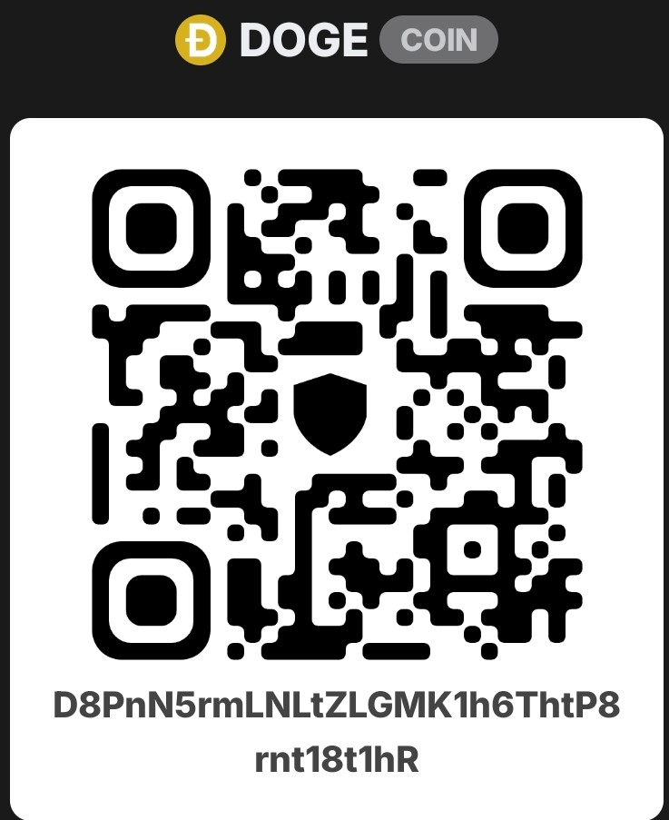
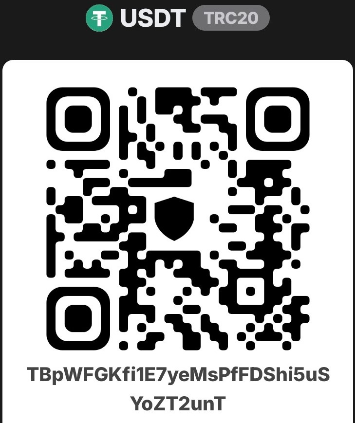

# Crypto Floating Window

A lightweight cryptocurrency price floating window built with AutoHotkey.

This tool displays real-time cryptocurrency prices in a small always-on-top window.
It supports Binance spot trading pairs and Dexscreener on-chain tokens with price changes and visual indicators.

## Features

* Binance spot price monitoring
* Dexscreener on-chain token price monitoring
* Real-time price updates
* 24-hour price change display
* Green/red price change indicators
* Price movement arrows
* Always-on-top floating window
* Low resource usage
* No installation required

## Supported APIs

* Binance API
* Dexscreener API

## Version

Current version: v1.0.1

### v1.0.1 Update

* Fixed on-chain token price refresh issues
* Changed Dexscreener tracking from token lookup to specific liquidity pool tracking
* Improved price stability for on-chain tokens

## Usage

Download the executable file and run it directly.

No installation required.

The program will display cryptocurrency prices in a floating window on your desktop.

## Configuration

Users can customize display settings and add their own tokens by editing the AutoHotkey source code.

## Source Code

The source code is written in AutoHotkey v2.

To modify the script, install AutoHotkey v2 first.

### Display Settings

```text
Refresh interval: 2000 ms

Window size: 350 x 160

Transparency: 220

Font size: 13

Row height: 25

Price position: 130

Change position: 220

Arrow position: 310

On-chain row height: 25

On-chain start offset: 10
```

## Binance Spot Tokens

Format:

```ahk
["Symbol", Decimal Places, Name Spacing]
```

Example:

```ahk
TokenList := [

    ["BTCUSDT",2,1],

    ["DOGEUSDT",5,0],

    ["TAOUSDT",1,1],

    ["SPCXBUSDT",1,0]

]
```

Parameters:

* `Symbol` - Binance trading pair
* `Decimal Places` - Number of decimal digits displayed for price
* `Name Spacing` - Spacing between characters in token name

## On-chain Tokens

Format:

```ahk
["Name", "Pair Address", Decimal Places, Name Spacing]
```

Example:

```ahk
OnChainTokenList := [

    ["NiuLai/USDT","0xE5Ae318389B8D6d09370a675479c64862152D126",5,1]

]
```

Parameters:

* `Name` - Display name
* `Pair Address` - Dexscreener liquidity pool address used for price tracking
* `Decimal Places` - Number of decimal digits displayed for price
* `Name Spacing` - Spacing between characters in token name

Note:

On-chain token monitoring uses Dexscreener pair addresses instead of token addresses to ensure accurate liquidity pool price tracking.

## Notes

* This project is created with AutoHotkey v2.
* The application is lightweight and designed for personal desktop monitoring.
* Cryptocurrency prices are provided by third-party APIs.
* This project is not a trading tool and does not provide investment advice.

## License

MIT License

## Support

If you find this project useful, you can support the author with a voluntary donation.

DOGE:

D8PnN5rmLNLtZLGMK1h6ThtP8rnt18t1hR



USDT (TRC20):

TBpWFGKfi1E7yeMsPfFDShi5uSYoZT2unT


